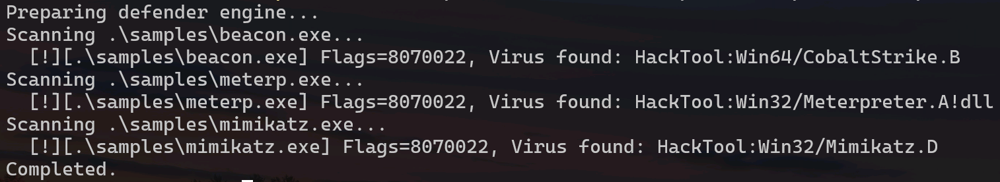

# mpengine_diskus
**参考自[taviso的项目代码](https://github.com/taviso/loadlibrary)，稍微逆向mpengine.dll练习逆向基础。**

#### 编译运行

*原作者的项目是用到Linux中的，我这里为了方便直接在windows里面运行，运行时在Windows中搜索defender目录中对应的文件的名称，并复制到defender目录中。其中一部分枚举、结构体定义直接照搬的大哥原项目的定义，大哥太厉害了。*

```powershell
cl.exe /DEBUG /Zi mptest.cc
.\mptest.exe sample.exe virus.exe ...
```



#### 问题

1. 运行结束时MpEngine.dll释放资源时，会出现非法内存访问；
2. 简陋。

